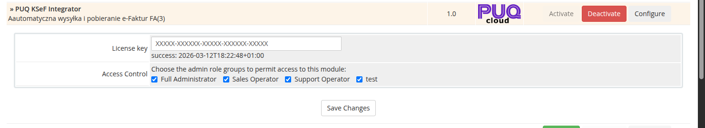

# Instalacja / Aktualizacja

### KSeF Integrator addon **[WHMCS](https://puqcloud.com/link.php?id=77)**
#####  [Order now](https://puqcloud.com/whmcs-addon-puq-ksef-integrator.php) | [Download](https://download.puqcloud.com/WHMCS/addons/PUQ_WHMCS-KSeF-Integrator/) | [FAQ](https://community.puqcloud.com/)

## Wymagania systemowe

| Wymaganie | Minimalna wersja          |
|-----------|---------------------------|
| **PHP** | 8.1, 8.2 lub nowszy       |
| **WHMCS** | 8.x, 9.x lub nowszy        |
| **ionCube Loader** | v13 lub nowszy (v14, v15) |
| **Rozszerzenie PHP** | OpenSSL, GD, cURL, DOM    |

> **Uwaga:** Modul uzywa kodowania ionCube. Upewnij sie, ze ionCube Loader jest zainstalowany i aktywny na serwerze.

---

## Pobieranie

Modul mozna zamowic i pobrac na stronie PUQ Cloud:

- **Zamow / Pobierz:** [https://puqcloud.com/index.php?rp=/store/whmcs-addon-puq-ksef-integrator](https://puqcloud.com/index.php?rp=/store/whmcs-addon-puq-ksef-integrator)
- **FAQ:** [https://community.puqcloud.com/](https://community.puqcloud.com/)
- **Bezposredni link do pobrania najnowszej wersji:**

PHP 8.1:
```
wget https://download.puqcloud.com/WHMCS/addons/PUQ_WHMCS-KSeF-Integrator/php81/PUQ_WHMCS-KSeF-Integrator-latest.zip
```

PHP 8.2+:
```
wget https://download.puqcloud.com/WHMCS/addons/PUQ_WHMCS-KSeF-Integrator/php82/PUQ_WHMCS-KSeF-Integrator-latest.zip
```

> W przypadku problemow z pobraniem pliku, wszystkie wersje dostepne sa pod adresem: [https://download.puqcloud.com/WHMCS/addons/PUQ_WHMCS-KSeF-Integrator/](https://download.puqcloud.com/WHMCS/addons/PUQ_WHMCS-KSeF-Integrator/)

Po pobraniu rozpakuj archiwum:

```
unzip PUQ_WHMCS-KSeF-Integrator-latest.zip
```

---

## Instalacja

### Krok 1: Przesylanie plikow

Rozpakuj archiwum modulu i przeslij katalog `puq_ksef_integrator` do katalogu modulow dodatkowych WHMCS:

```
/twoj-whmcs/modules/addons/puq_ksef_integrator/
```

Struktura katalogu po przeslaniu:

```
modules/addons/puq_ksef_integrator/
    puq_ksef_integrator.php
    hooks.php
    whmcs.json
    version
    logo.png
    lib/
        puqKSeFIntegrator.php
        puqKSeFClient.php
        puqKSeFIntegratorQrCode.php
        puqKSeFIntegratorPdfHelper.php
    lang/
        english.php
        polish.php
    templates/
        ...
```

### Krok 2: Aktywacja modulu

1. Zaloguj sie do panelu administracyjnego WHMCS
2. Przejdz do **Setup** > **Addon Modules**
3. Znajdz **PUQ KSeF Integrator** na liscie
4. Kliknij **Activate**

Podczas aktywacji modul automatycznie tworzy trzy tabele w bazie danych:
- `puq_ksef_certificates` — certyfikaty do uwierzytelniania
- `puq_ksef_invoices` — rejestr faktur KSeF
- `puq_ksef_settings` — ustawienia modulu

### Krok 3: Konfiguracja klucza licencyjnego

1. Po aktywacji kliknij **Configure** obok modulu
2. Wpisz klucz licencyjny w polu **License key**
3. Wybierz grupy administratorow, ktore maja miec dostep do modulu
4. Kliknij **Save Changes**

Po zapisaniu, pod polem klucza licencyjnego pojawi sie status weryfikacji (np. `success: 2026-03-12T18:22:48+01:00`).


*01-whmcs-addon-config-license.png*

### Krok 4: Konfiguracja modulu

Przejdz do **Addons** > **PUQ KSeF Integrator** > **Ustawienia** > **Konfiguracja** i skonfiguruj dane firmy, certyfikaty oraz tryb wysylki. Szczegoly opisane sa na stronie [Konfiguracja](#).

---

## Aktualizacja

### Krok 1: Kopia zapasowa

Przed aktualizacja zalecamy wykonanie kopii zapasowej:
- Bazy danych WHMCS (szczegolnie tabel `puq_ksef_*`)
- Plikow modulu w `modules/addons/puq_ksef_integrator/`

### Krok 2: Przeslanie nowych plikow

Rozpakuj nowa wersje archiwum i nadpisz wszystkie pliki w katalogu:

```
/twoj-whmcs/modules/addons/puq_ksef_integrator/
```

### Krok 3: Weryfikacja

1. Zaloguj sie do panelu administracyjnego WHMCS
2. Przejdz do **Addons** > **PUQ KSeF Integrator**
3. Sprawdz numer wersji w prawym gornym rogu nawigacji (np. `v1.0`)
4. Przejdz do **Ustawienia** > **Sprawdz srodowisko**, aby upewnic sie, ze wszystkie wymagania sa spelnione

> Modul automatycznie wykrywa brakujace kolumny w tabelach i dodaje je podczas pierwszego uruchomienia po aktualizacji. Nie jest wymagana ponowna aktywacja.

---

## Dezaktywacja

> **Uwaga:** Dezaktywacja modulu **trwale usuwa** wszystkie tabele modulu z bazy danych (`puq_ksef_certificates`, `puq_ksef_invoices`, `puq_ksef_settings`). Wszystkie dane o certyfikatach, fakturach KSeF i ustawieniach zostana utracone.

1. Przejdz do **Setup** > **Addon Modules**
2. Kliknij **Deactivate** obok PUQ KSeF Integrator
3. Potwierdz dezaktywacje
