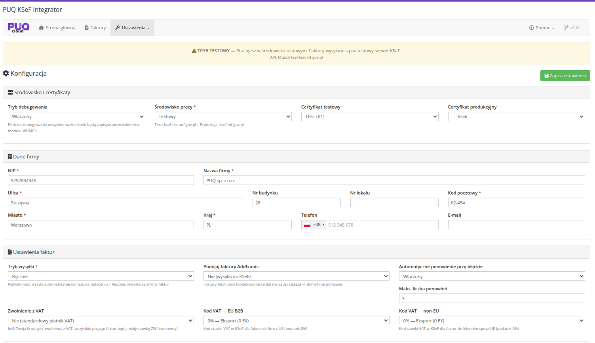

# Konfiguracja

### KSeF Integrator addon **[WHMCS](https://puqcloud.com/link.php?id=77)**
#####  [Order now](https://puqcloud.com/whmcs-addon-puq-ksef-integrator.php) | [Download](https://download.puqcloud.com/WHMCS/addons/PUQ_WHMCS-KSeF-Integrator/) | [FAQ](https://community.puqcloud.com/)

Strona konfiguracji modulu dostepna jest w: **Addons** > **PUQ KSeF Integrator** > **Ustawienia** > **Konfiguracja**

*06-konfiguracja.png*

---

## Srodowisko i certyfikaty

| Pole | Opis |
|------|------|
| **Tryb debugowania** | Wlaczony / Wylaczony. Gdy wlaczony, wszystkie wazne kroki sa zapisywane w dzienniku modulu WHMCS (Utilities > Logs > Module Log) |
| **Srodowisko pracy** | **Testowe** — faktury sa wysylane na serwer testowy KSeF (`ksef-test.mf.gov.pl`). **Produkcyjne** — faktury sa wysylane na serwer produkcyjny (`ksef.mf.gov.pl`). |
| **Certyfikat testowy** | Certyfikat uzywany do uwierzytelniania w srodowisku testowym KSeF. Wybierz z listy certyfikatow dodanych w zakladce [Certyfikaty](#). |
| **Certyfikat produkcyjny** | Certyfikat uzywany do uwierzytelniania w srodowisku produkcyjnym KSeF. |

> **Wazne:** Certyfikat testowy moze byc uzyty tylko w srodowisku testowym, a certyfikat produkcyjny — tylko w srodowisku produkcyjnym.

---

## Dane firmy

W tej sekcji nalezy podac dane sprzedawcy, ktore beda umieszczone na kazdej e-Fakturze wystawianej do KSeF.

| Pole | Opis | Wymagane |
|------|------|----------|
| **NIP** | 10-cyfrowy Numer Identyfikacji Podatkowej firmy | Tak |
| **Nazwa firmy** | Pelna nazwa firmy | Tak |
| **Ulica** | Nazwa ulicy | Tak |
| **Nr budynku** | Numer budynku | Tak |
| **Nr lokalu** | Numer lokalu/mieszkania | Nie |
| **Kod pocztowy** | Kod pocztowy (format: XX-XXX) | Tak |
| **Miasto** | Nazwa miasta | Tak |
| **Kraj** | Kod kraju (domyslnie: PL) | Tak |
| **Telefon** | Numer telefonu firmy | Nie |
| **E-mail** | Adres e-mail firmy | Nie |

> **Uwaga:** NIP musi byc prawidlowym 10-cyfrowym polskim numerem identyfikacji podatkowej. Modul waliduje NIP przed wysylka.

---

## Ustawienia faktur

| Pole | Opis |
|------|------|
| **Tryb wysylki** | **Natychmiast po oplaceniu** — faktury sa automatycznie wysylane do KSeF zaraz po oplaceniu w WHMCS. **Reczny** — faktury sa zapisywane w kolejce ze statusem "oczekuje", administrator musi je wyslac recznie. |
| **Automatyczne ponowienie przy bledzie** | Wlaczony / Wylaczony. Gdy wlaczony, modul automatycznie podejmie probe ponownej wysylki w przypadku bledu. |
| **Maks. liczba ponowien** | Maksymalna liczba prob ponownej wysylki (domyslnie: 3). |
| **Zwolnienie z VAT** | **Nie (standardowy platnik VAT)** — firma rozlicza VAT normalnie. **Tak (firma zwolniona z VAT)** — wszystkie pozycje faktur beda mialy stawke ZW (zwolniony). |
| **Kod VAT — EU B2B** | Kod stawki VAT w KSeF dla faktur do firm z UE (podatek 0%). Dostepne opcje: `0% — Eksport (0 EX)`, `0% — WDT (0 WDT)`, `0% — Kraj (0 KR)`, `zwolniony (zw)`, `nie podlega (np)`, `odwrotne obciazenie (oo)`. |
| **Kod VAT — non-EU** | Kod stawki VAT w KSeF dla faktur do klientow spoza UE (podatek 0%). Te same opcje co powyzej. |

---

## Zapisywanie ustawien

Po wprowadzeniu wszystkich danych kliknij przycisk **Zapisz ustawienia** w prawym gornym rogu strony.

Pomyslne zapisanie jest potwierdzane komunikatem powodzenia.

> **Wskazowka:** Po skonfigurowaniu danych firmy i certyfikatow, przejdz do strony glownej modulu i uzyj przycisku **Testuj polaczenie**, aby sprawdzic czy modul moze poprawnie polaczyc sie z serwerem KSeF.
