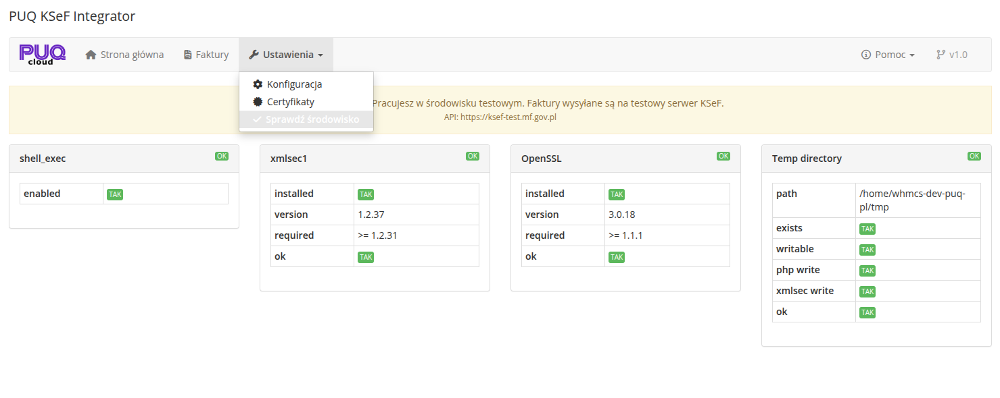

# Sprawdzenie srodowiska

### KSeF Integrator addon **[WHMCS](https://puqcloud.com/link.php?id=77)**
#####  [Order now](https://puqcloud.com/whmcs-addon-puq-ksef-integrator.php) | [Download](https://download.puqcloud.com/WHMCS/addons/PUQ_WHMCS-KSeF-Integrator/) | [FAQ](https://community.puqcloud.com/)

Strona sprawdzania srodowiska dostepna jest w: **Addons** > **PUQ KSeF Integrator** > **Ustawienia** > **Sprawdz srodowisko**


*10-sprawdzenie-srodowiska.png*

Ta strona diagnostyczna automatycznie sprawdza, czy serwer spelnia wszystkie wymagania techniczne niezbedne do prawidlowego dzialania modulu.

---

## Sprawdzane komponenty

### 1. shell_exec

| Parametr | Opis |
|----------|------|
| **enabled** | Czy funkcja `shell_exec` jest dostepna w PHP |

Funkcja `shell_exec` jest wymagana do wywolyywania narzedzia `xmlsec1` do podpisywania XAdES.

**Jak naprawic:** Upewnij sie, ze `shell_exec` nie jest wymieniony w dyrektywie `disable_functions` w pliku `php.ini`.

### 2. xmlsec1

| Parametr | Opis |
|----------|------|
| **installed** | Czy narzedzie `xmlsec1` jest zainstalowane |
| **version** | Aktualna wersja `xmlsec1` |
| **required** | Minimalna wymagana wersja (`>= 1.2.31`) |
| **ok** | Czy wersja spelnia wymagania |

Narzedzie `xmlsec1` jest uzywane do generowania podpisow XAdES wymaganych przez KSeF do uwierzytelniania.

**Jak zainstalowac:**

```bash
# Debian/Ubuntu
apt-get install xmlsec1

# CentOS/RHEL
yum install xmlsec1 xmlsec1-openssl

# AlmaLinux
dnf install xmlsec1 xmlsec1-openssl
```

### 3. OpenSSL

| Parametr | Opis |
|----------|------|
| **installed** | Czy OpenSSL jest zainstalowany |
| **version** | Aktualna wersja OpenSSL |
| **required** | Minimalna wymagana wersja (`>= 1.1.1`) |
| **ok** | Czy wersja spelnia wymagania |

OpenSSL jest uzywany do szyfrowania RSA-OAEP i AES-256-CBC.

### 4. Katalog tymczasowy (Temp directory)

| Parametr | Opis |
|----------|------|
| **path** | Sciezka do katalogu tymczasowego |
| **exists** | Czy katalog istnieje |
| **writable** | Czy katalog jest zapisywalny |
| **php write** | Czy PHP moze tworzyc pliki w katalogu |
| **xmlsec write** | Czy `xmlsec1` moze zapisywac pliki w katalogu |
| **ok** | Czy wszystkie testy przeszly |

Katalog tymczasowy jest uzywany do przechowywania plikow tymczasowych podczas podpisywania XAdES.

**Jak naprawic:** Upewnij sie, ze katalog tymczasowy istnieje i ma odpowiednie uprawnienia:

```bash
chmod 777 /tmp
# lub uzyj katalogu tymczasowego WHMCS
chmod 777 /home/twoj-whmcs/tmp
```

---

## Interpretacja wynikow

- **OK** (zielony) — komponent dziala prawidlowo
- **TAK** (zielona etykieta) — test zaliczony
- **NIE** (czerwona etykieta) — test niezaliczony, wymaga naprawy
- **BLAD** (czerwony) — komponent nie jest dostepny

> **Wskazowka:** Wszystkie cztery komponenty musza miec status **OK**, aby modul mogl prawidlowo wysylac faktury do KSeF.
