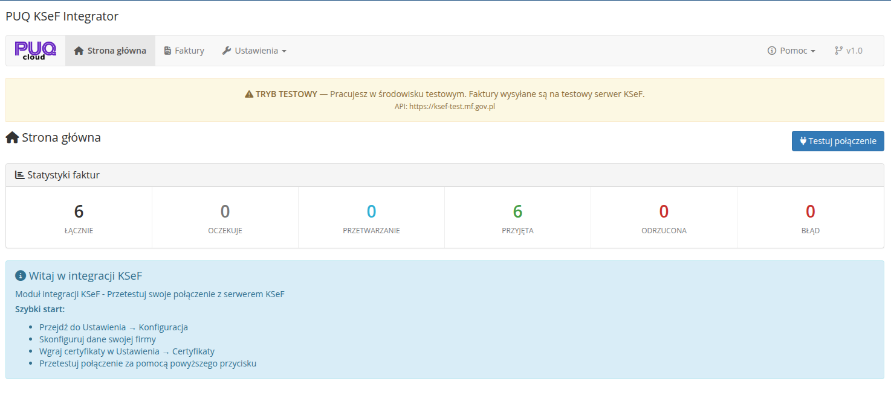
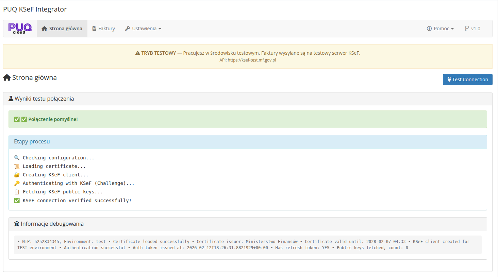

# Strona glowna i test polaczenia

### KSeF Integrator addon **[WHMCS](https://puqcloud.com/link.php?id=77)**
#####  [Order now](https://puqcloud.com/whmcs-addon-puq-ksef-integrator.php) | [Download](https://download.puqcloud.com/WHMCS/addons/PUQ_WHMCS-KSeF-Integrator/) | [FAQ](https://community.puqcloud.com/)

Strona glowna modulu dostepna jest w: **Addons** > **PUQ KSeF Integrator** > **Strona glowna**

*03-strona-glowna.png*

---

## Statystyki faktur

Na gorze strony glownej wyswietlany jest panel ze statystykami faktur KSeF:

| Statystyka | Opis |
|------------|------|
| **Lacznie** | Calkowita liczba faktur w systemie KSeF modulu |
| **Oczekuje** | Faktury w kolejce czekajace na wysylke |
| **Przetwarzanie** | Faktury wyslane, oczekujace na odpowiedz KSeF |
| **Przyjeta** | Faktury pomyslnie przyjete przez KSeF |
| **Odrzucona** | Faktury odrzucone przez KSeF |
| **Blad** | Faktury z bledem walidacji lub polaczenia |

---

## Szybki start

Na stronie glownej wyswietlany jest przewodnik szybkiego startu z krokami konfiguracji:

1. Przejdz do **Ustawienia** > **Konfiguracja**
2. Skonfiguruj dane swojej firmy
3. Wgraj certyfikaty w **Ustawienia** > **Certyfikaty**
4. Przetestuj polaczenie za pomoca przycisku ponizej

---

## Test polaczenia

Przycisk **Testuj polaczenie** w prawym gornym rogu strony glownej pozwala zweryfikowac, czy modul moze poprawnie polaczyc sie z serwerem KSeF.

*04-test-polaczenia-sukces.png*

### Etapy testu

Test polaczenia wykonuje nastepujace kroki:

1. **Checking configuration...** — sprawdzanie konfiguracji modulu (NIP, srodowisko)
2. **Loading certificate...** — ladowanie certyfikatu z bazy danych
3. **Creating KSeF client...** — tworzenie klienta API KSeF
4. **Authenticating with KSeF (Challenge)...** — uwierzytelnianie w KSeF za pomoca podpisu XAdES
5. **Fetching KSeF public keys...** — pobieranie kluczy publicznych KSeF do szyfrowania
6. **KSeF connection verified successfully!** — polaczenie zostalo zweryfikowane pomyslnie

### Wyniki testu

**Polaczenie pomyslne** — zielony komunikat potwierdzajacy poprawnosc konfiguracji.

W sekcji **Informacje debugowania** wyswietlane sa szczegolowe dane:
- NIP i srodowisko
- Wystawca certyfikatu i data waznosci
- Data wydania tokenu uwierzytelniania
- Liczba pobranych kluczy publicznych

**Polaczenie nieudane** — czerwony komunikat z opisem bledu. Najczestsze przyczyny:

| Blad | Rozwiazanie |
|------|-------------|
| Certificate not found | Dodaj certyfikat w Ustawienia > Certyfikaty |
| Certificate expired | Wgraj nowy, wazny certyfikat |
| Authentication failed | Sprawdz, czy certyfikat jest prawidlowy i odpowiada srodowisku |
| NIP not configured | Wypelnij NIP w Ustawienia > Konfiguracja |
| xmlsec1 not available | Zainstaluj xmlsec1 (patrz: Sprawdzenie srodowiska) |

---

## Tryb testowy

Gdy srodowisko jest ustawione na **Testowe**, na gorze kazdej strony modulu wyswietlany jest zolty baner:

> **TRYB TESTOWY** — Pracujesz w srodowisku testowym. Faktury wysylane sa na testowy serwer KSeF.
> API: https://ksef-test.mf.gov.pl

Zaleca sie rozpoczecie pracy w trybie testowym, a po pomyslnym przetestowaniu przelaczenie na srodowisko produkcyjne.
