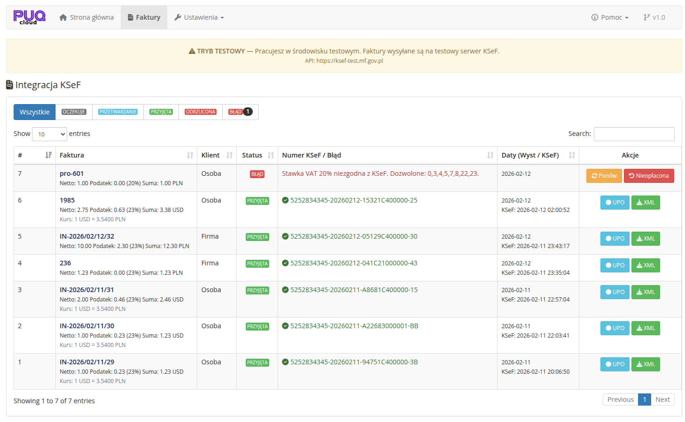
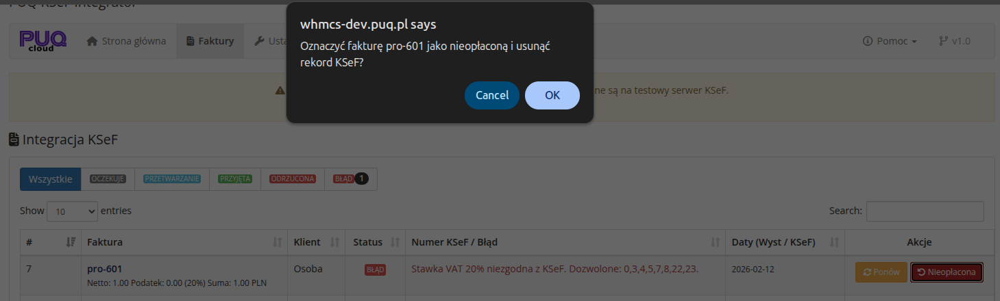

# Lista faktur

### KSeF Integrator addon **[WHMCS](https://puqcloud.com/link.php?id=77)**
#####  [Order now](https://puqcloud.com/whmcs-addon-puq-ksef-integrator.php) | [Download](https://download.puqcloud.com/WHMCS/addons/PUQ_WHMCS-KSeF-Integrator/) | [FAQ](https://community.puqcloud.com/)

Strona listy faktur dostepna jest w: **Addons** > **PUQ KSeF Integrator** > **Faktury**

*16-lista-faktur-ogolna.png*

*17-lista-faktur-filtry-nieoplacona.png*

---

## Filtry statusow

Na gorze strony znajduja sie przyciski filtrowania wedlug statusu:

| Filtr | Opis |
|-------|------|
| **Wszystkie** | Wszystkie faktury |
| **Oczekuje** | Faktury czekajace na wysylke |
| **Przetwarzanie** | Faktury w trakcie przetwarzania przez KSeF |
| **Przyjeta** | Faktury pomyslnie przyjete przez KSeF |
| **Odrzucona** | Faktury odrzucone przez KSeF |
| **Blad** | Faktury z bledem |

Przy kazdym filtrze wyswietlana jest liczba faktur o danym statusie (badge z liczba).

---

## Tabela faktur

| Kolumna | Opis |
|---------|------|
| **#** | ID rekordu w tabeli KSeF |
| **Faktura** | Numer faktury WHMCS, kwota netto, podatek, stawka VAT, suma brutto, waluta |
| **Klient** | Typ klienta (Firma / Osoba) |
| **Status** | Status KSeF (kolorowa etykieta) |
| **Numer KSeF / Blad** | Numer KSeF (jesli przyjeta) lub opis bledu (jesli blad/odrzucona) |
| **Daty (Wyst / KSeF)** | Data wystawienia i data przyjcia przez KSeF |
| **Akcje** | Przyciski akcji dostepne dla danego statusu |

---

## Akcje

### Dla faktur ze statusem "Przyjeta"

- **Pobierz UPO** (zielony) — pobiera plik UPO (Urzedowe Poswiadczenie Odbioru) w formacie XML
- **XML** (niebieski) — wyswietla zawartosc XML faktury FA(3)

### Dla faktur ze statusem "Oczekuje"

- **Wyslij teraz** (niebieski) — natychmiast wysyla fakture do KSeF. Operacja moze potrwac 20-30 sekund.
- **Nieoplacona** (zolty) — oznacza fakture jako nieoplacona w WHMCS i usuwa rekord KSeF

### Dla faktur ze statusem "Blad" lub "Odrzucona"

- **Ponow** (zielony) — ponawia probe wysylki. Modul ponownie zbiera dane, generuje XML i ustawia status na "oczekuje"
- **Nieoplacona** (zolty) — oznacza fakture jako nieoplacona w WHMCS i usuwa rekord KSeF

---

## Wyszukiwanie

Pole **Search** pozwala wyszukiwac faktury po:
- Numerze faktury WHMCS
- Numerze KSeF
- Referencji KSeF

---

## Potwierdzenia akcji

Przed wykonaniem destrukcyjnych akcji wyswietlane sa okna potwierdzenia:

- **Wyslij teraz:** "Uwaga: Data wystawienia i termin platnosci faktury zostana zmienione na dzisiejsza date. Kontynuowac?"
- **Nieoplacona:** "Oznaczyc fakture [numer] jako nieoplacona i usunac rekord KSeF?"

*17-lista-faktur-filtry-nieoplacona.png*
