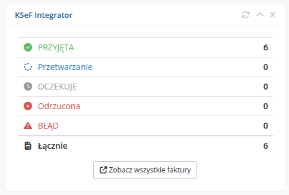

# Widget na dashboardzie

### KSeF Integrator addon **[WHMCS](https://puqcloud.com/link.php?id=77)**
#####  [Order now](https://puqcloud.com/whmcs-addon-puq-ksef-integrator.php) | [Download](https://download.puqcloud.com/WHMCS/addons/PUQ_WHMCS-KSeF-Integrator/) | [FAQ](https://community.puqcloud.com/)

Modul automatycznie dodaje widget **KSeF Integrator** na stronie glownej panelu administracyjnego WHMCS (Dashboard).

*02-widget-dashboard.png*

---

## Zawartosc widgetu

Widget wyswietla podsumowanie statusow wszystkich faktur KSeF:

| Status | Ikona | Opis |
|--------|-------|------|
| **PRZYJETA** | Zielone kolko | Liczba faktur pomyslnie przyjetych przez KSeF |
| **Przetwarzanie** | Niebieski spinner | Liczba faktur w trakcie przetwarzania |
| **OCZEKUJE** | Szary zegar | Liczba faktur w kolejce do wysylki |
| **Odrzucona** | Czerwony krzyzyk | Liczba faktur odrzuconych przez KSeF |
| **BLAD** | Czerwony trojkat | Liczba faktur z bledem |
| **Lacznie** | Ikona faktury | Calkowita liczba faktur |

Dla statusow **Odrzucona** i **BLAD**, jesli liczba jest wieksza niz 0, wyswietlany jest klikalny link, ktory prowadzi do przefiltrowanej listy faktur.

---

## Przycisk

Na dole widgetu znajduje sie przycisk **Zobacz wszystkie faktury**, ktory prowadzi do pelnej listy faktur modulu.

---

## Odswiezanie

Widget posiada wbudowane cache'owanie z czasem wygasniecia 120 sekund. Dane sa automatycznie odswiezane po uplywie tego czasu.

Aby recznie odswiezyc widget, uzyj ikony odswiezania w prawym gornym rogu widgetu.

---

## Brak faktur

Gdy w systemie nie ma jeszcze zadnych faktur KSeF, widget wyswietla komunikat:

> Brak faktur

Wraz z przyciskiem **Zobacz wszystkie faktury**.
