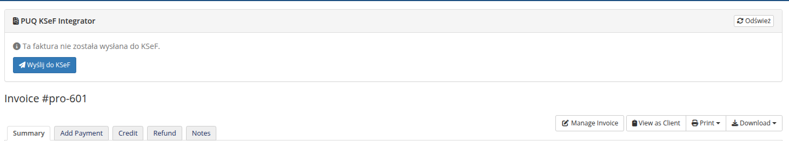
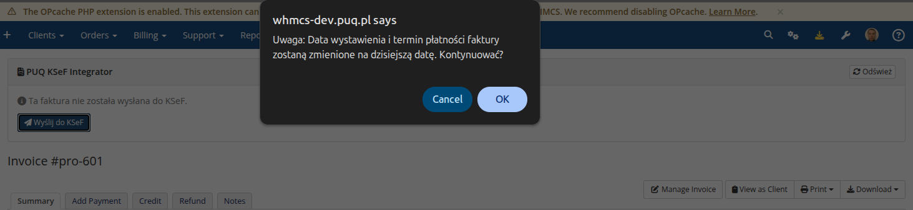
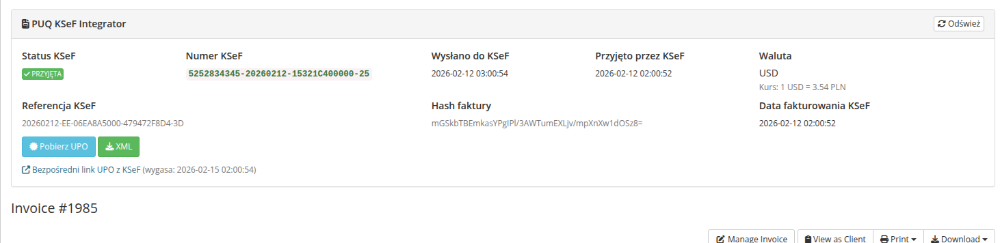

# Panel KSeF na stronie faktury

### KSeF Integrator addon **[WHMCS](https://puqcloud.com/link.php?id=77)**
#####  [Order now](https://puqcloud.com/whmcs-addon-puq-ksef-integrator.php) | [Download](https://download.puqcloud.com/WHMCS/addons/PUQ_WHMCS-KSeF-Integrator/) | [FAQ](https://community.puqcloud.com/)

Modul automatycznie dodaje panel **PUQ KSeF Integrator** na kazdej stronie szczegolowej faktury w panelu administracyjnym WHMCS (Billing > Invoices > [faktura]).

Panel jest wyswietlany na gorze strony faktury i zawiera wszystkie informacje dotyczace statusu KSeF danej faktury.

---

## Faktura nie wyslana do KSeF

Jesli faktura nie zostala jeszcze wyslana do KSeF, panel wyswietla komunikat:

> Ta faktura nie zostala wyslana do KSeF.

Wraz z przyciskiem **Wyslij do KSeF**.

*12-panel-ksef-nie-wyslana.png*

### Akcja "Wyslij do KSeF"

1. Kliknij przycisk **Wyslij do KSeF**
2. Pojawi sie okno potwierdzenia: "Uwaga: Data wystawienia i termin platnosci faktury zostana zmienione na dzisiejsza date. Kontynuowac?"

*13-panel-ksef-potwierdzenie-wysylki.png*

3. Po potwierdzeniu modul zbierze dane, wygeneruje XML i doda fakture do kolejki KSeF ze statusem "oczekuje"

> **Uwaga:** Ta akcja jest dostepna tylko dla faktur ze statusem **Paid** (oplacona) w WHMCS.

---

## Faktura ze statusem "Blad"

Gdy faktura ma status **Blad**, panel wyswietla:

- **Status KSeF:** BLAD (czerwona etykieta)
- **Numer KSeF:** —
- **Wyslano do KSeF:** —
- **Przyjto przez KSeF:** —
- **Waluta:** PLN
- Opis bledu w czerwonym polu (np. "Stawka VAT 20% niezgodna z KSeF. Dozwolone: 0,3,4,5,7,8,22,23.")

Dostepne akcje:
- **Ponow** (zielony) — ponowna proba wysylki
- **Oznacz nieoplacona** (zolty) — cofniecie faktury do statusu Draft

*15-panel-ksef-status-blad.png*

Potwierdzenie oznaczenia jako nieoplacona z poziomu panelu faktury:

*18-panel-ksef-potwierdzenie-nieoplacona.png*

---

## Faktura przyjta przez KSeF

Gdy faktura zostanie pomyslnie przyjta przez KSeF, panel wyswietla pelne informacje:

| Pole | Opis | Przyklad |
|------|------|---------|
| **Status KSeF** | PRZYJETA (zielona etykieta) | |
| **Numer KSeF** | Unikalny numer faktury w KSeF (klikalny link) | `5252834345-20260212-15321C400000-25` |
| **Wyslano do KSeF** | Data i godzina wysylki | `2026-02-12 03:00:54` |
| **Przyjto przez KSeF** | Data i godzina przyjcia | `2026-02-12 02:00:52` |
| **Waluta** | Waluta faktury z kursem (dla walut obcych) | `USD` / Kurs: 1 USD = 3.54 PLN |
| **Referencja KSeF** | Numer referencyjny sesji | `20260212-EE-06EA8A5000-479472F8D4-3D` |
| **Hash faktury** | Hash SHA-256 faktury | `mGSkbTBEmkasYPglPl/3AWTumEXLjv/...` |
| **Data fakturowania KSeF** | Data fakturowania przypisana przez KSeF | `2026-02-12 02:00:52` |

Dostepne akcje:
- **Pobierz UPO** (zielony) — pobieranie UPO w formacie XML
- **XML** (niebieski) — podglad XML faktury FA(3)

*19-panel-ksef-przyjeta.png*

Pod panelem wyswietlany jest rowniez link:
> Bezposredni link UPO z KSeF (wygasa: 2026-02-15 02:00:54)

---

## Przycisk "Odswiez"

W prawym gornym rogu panelu znajduje sie przycisk **Odswiez**, ktory pozwala odswiezyc dane panelu bez przeladowania calej strony.
